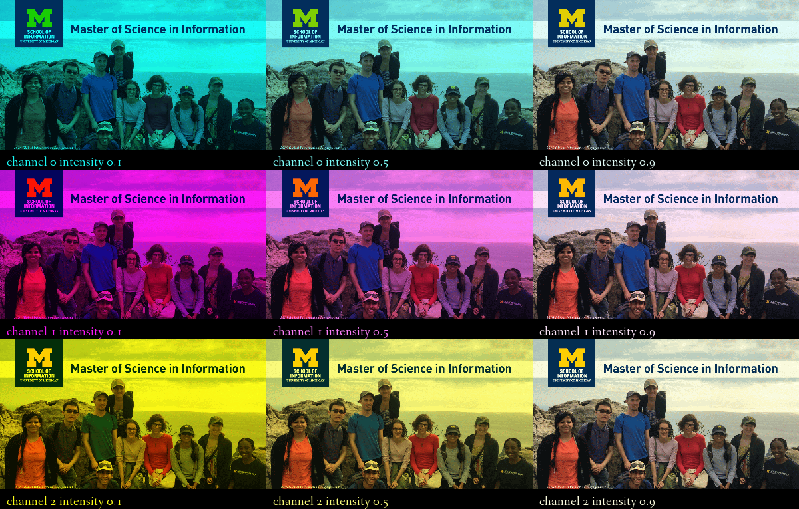

# Assignment 1: Building a Better Contact Sheet

I wrote all of my code from scratch because I found almost all of the sample code to be too difficult to modify for this situation. It has been excluded as a result. Also, since I got rid of the sample code, I decided that I may as well just paste my code into a whole new notebook for submission and not include any of the assignment directions. This will also make it easier for me to share my work on Github and for the focus of anyone who views it to be on my work itself and not where it came from.

My code contains four for loops. The first three are for varying the intensity of the red, green and blue color bands of the original image. In addition, each loop creates labels for each modified photo, pastes the photos and labels together on a blank sheet and then passes these labeled, modified pictures to a list. The final loop iterates through this list and pastes each image on a larger sheet in rows according to the intensity of which color is varied.


```python
display(contact_sheet)
```





```python
import PIL
from PIL import Image, ImageEnhance, ImageDraw, ImageFont
import numpy as np

pics = []

for i in (0.1, 0.5, 0.9):
    image=Image.open("readonly/msi_recruitment.gif")
    image=image.convert('RGB')
    r, g, b = image.split()
    r = r.point(lambda x: x * i)
    out = Image.merge('RGB', (r, g, b))
    out = out.resize((int(out.width / 2), (int(out.height / 2))))
    rect = Image.new('RGB', (out.width, 30), color = (0, 0, 0))
    d = ImageDraw.Draw(rect)
    fnt = ImageFont.truetype('readonly/fanwood-webfont.ttf', 20)
    d.text((10, 10), 'channel 0 intensity {}'.format(i), font = fnt, fill = out.getpixel((0, 50)))
    sheet = PIL.Image.new(out.mode, (out.width, out.height + rect.height))
    sheet.paste(rect, (0, out.height))
    sheet.paste(out, (0, 0))
    pics.append(sheet)
    
for i in (0.1, 0.5, 0.9):
    image=Image.open("readonly/msi_recruitment.gif")
    image=image.convert('RGB')
    r, g, b = image.split()
    g = g.point(lambda x: x * i)
    out = Image.merge('RGB', (r, g, b))
    out = out.resize((int(out.width / 2), (int(out.height / 2))))
    rect = Image.new('RGB', (out.width, 30), color = (0, 0, 0))
    d = ImageDraw.Draw(rect)
    fnt = ImageFont.truetype('readonly/fanwood-webfont.ttf', 20)
    d.text((10, 10), 'channel 1 intensity {}'.format(i), font = fnt, fill = out.getpixel((0, 50)))
    sheet = PIL.Image.new(out.mode, (out.width, out.height + rect.height))
    sheet.paste(rect, (0, out.height))
    sheet.paste(out, (0, 0))
    pics.append(sheet)
    
for i in (0.1, 0.5, 0.9):
    image=Image.open("readonly/msi_recruitment.gif")
    image=image.convert('RGB')
    r, g, b = image.split()
    b = b.point(lambda x: x * i)
    out = Image.merge('RGB', (r, g, b))
    out = out.resize((int(out.width / 2), (int(out.height / 2))))
    rect = Image.new('RGB', (out.width, 30), color = (0, 0, 0))
    d = ImageDraw.Draw(rect)
    fnt = ImageFont.truetype('readonly/fanwood-webfont.ttf', 20)
    d.text((10, 10), 'channel 2 intensity {}'.format(i), font = fnt, fill = out.getpixel((0, 50)))
    sheet = PIL.Image.new(out.mode, (out.width, out.height + rect.height))
    sheet.paste(rect, (0, out.height))
    sheet.paste(out, (0, 0))
    pics.append(sheet)
    
first_image = pics[0]

contact_sheet = PIL.Image.new(first_image.mode, (first_image.width * 3, first_image.height * 3))
x = 0
y = 0

for image in pics:
    contact_sheet.paste(image, (x, y))
    if x + first_image.width == contact_sheet.width:
        x = 0
        y = y + first_image.height 
    else:
        x = x + first_image.width
```
