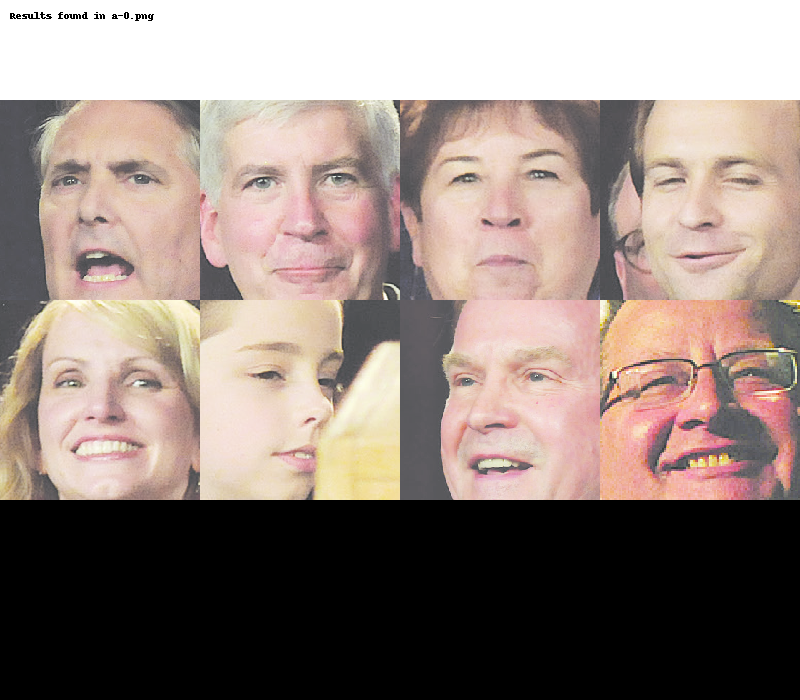
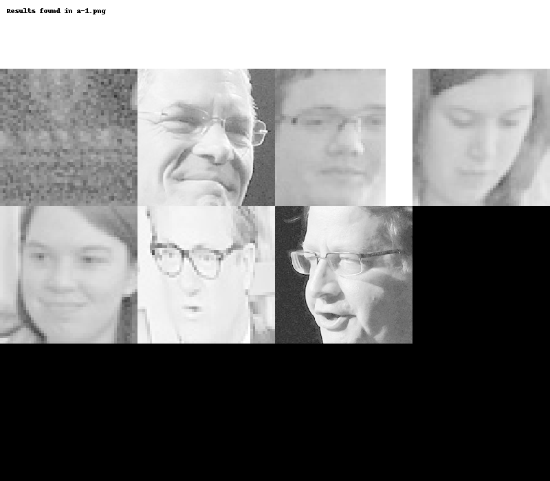
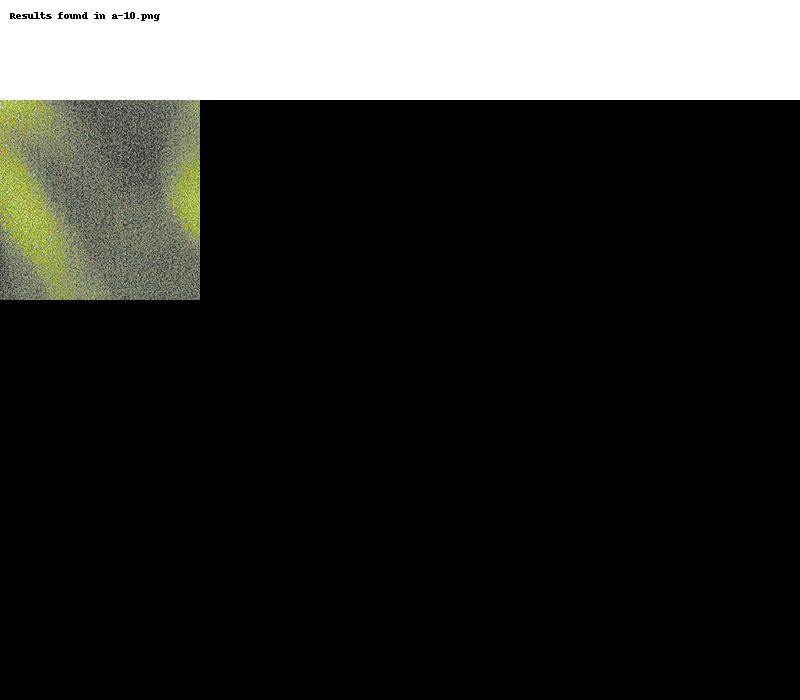
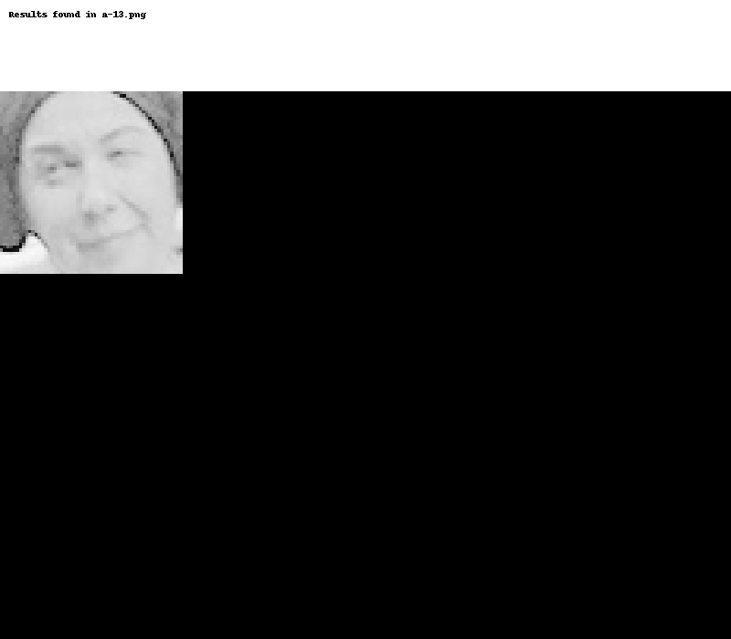
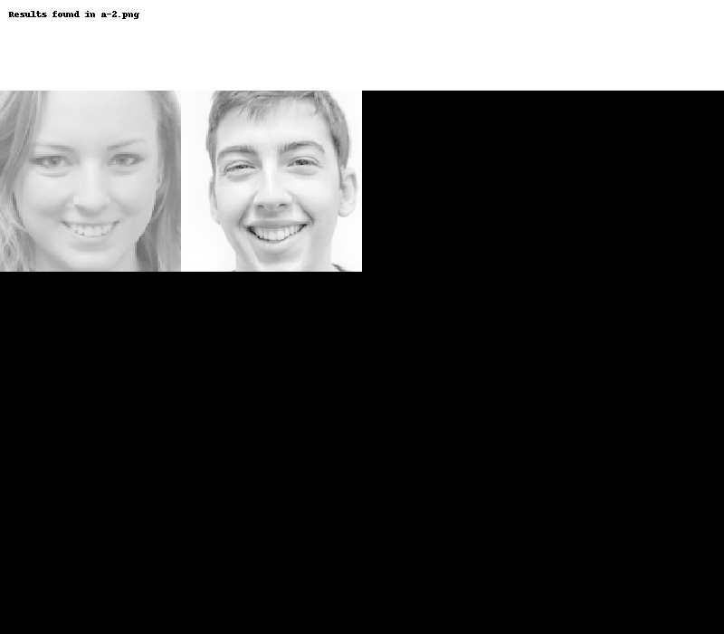
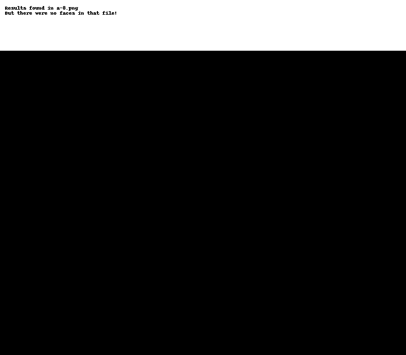
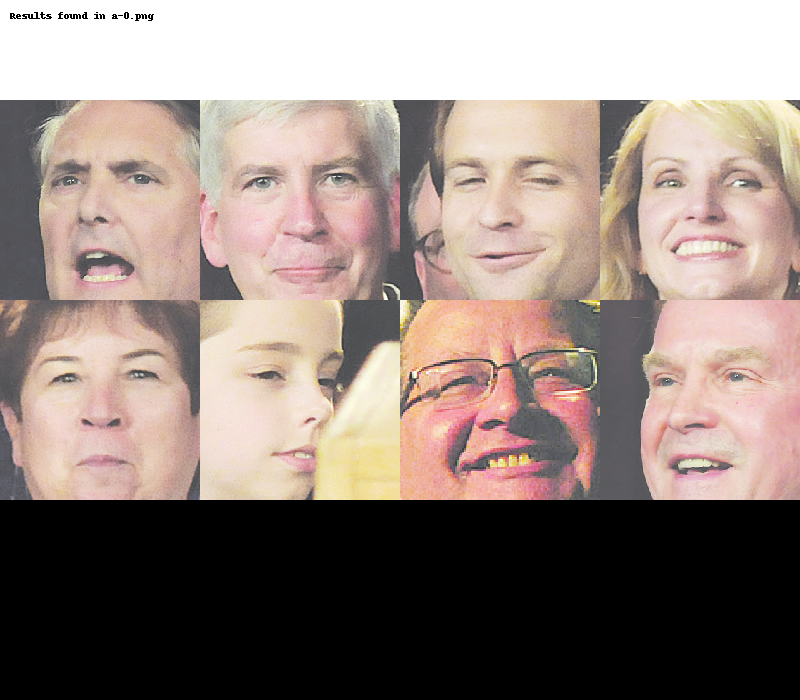
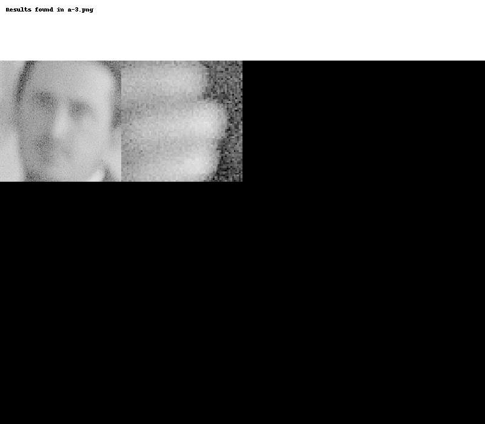

# Final project: Face recognition using opencv based on search results from optical character recognition using pytesseract

Displayed below are the results from my implementation of the image_to_string and CascadeClassifier algorithms from pytesseract and opencv, respectively.

The image_to_string algorithm from pytesseract searches for text inside of images and returns what it finds in an image as a string. The algorithm performed quite well using the images for this assignment. Based on the results it returned for each image, the algorithm seemed to detect column boundaries even when such boundaries were not actually drawn on images. The results from each run of the image_to_string algorithm were first stored in a list and logical operators were used to search each list entry to see if it contained the word 'Mark' or 'Christopher' depending on which set of images was being analyzed.

The CascadeClassifier algorithm from opencv searches an image in PIL.Image.Image format for faces and returns a tuple of coordinates for the corners of a square which encloses the detected face. There are several parameters that can be adjusted to refine results, and I found that rescaling the image for search purposes and setting a minimum size for face detection greatly improved performance of the algorithm on the given image set.


```python
detect_faces('Mark', 'readonly/images.zip')

detect_faces('Christopher', 'readonly/small_img.zip')
```


























```python
"""
Created on Thu May 16 18:33:36 2019

@author: gabrielbutler
"""
import zipfile
import io

from PIL import Image, ImageDraw
import pytesseract
import cv2 as cv
import numpy as np


def detect_faces(search_term, zipname):
    #add zip file as a variable
    file = zipfile.ZipFile(zipname, 'r')
    
    #add string to search text for
    search_string = search_term
    
    #unpack zip file
    #one list of png images for text searching
    #one list of arrays for face detection
    zip_contents = []
    zip_contents_png = []
    file_names = []    
    for name in file.namelist():
        file_names.append(name)
        image = file.read(name)
        image = Image.open(io.BytesIO(image))
        zip_contents_png.append(image)
        image = np.asarray(image, dtype = 'uint8')
        zip_contents.append(image)

    #extract text from each picture
    text_content = []    
    for pic in zip_contents_png:
        text = pytesseract.image_to_string(pic)
        text_content.append(text)    
    
    #search text and store results
    search_results = []
    for article in text_content:
        if search_string in article:
            search_results.append(True)
        else:
            search_results.append(False)
    
    #organize results by filename
    results_by_name = {}    
    for name, result in zip(file_names, search_results):
        results_by_name[name] = result
    
    #crop faces using face detection algorithm
    #scalefactor 1.3505 worked well
    face_cascade = cv.CascadeClassifier('readonly/haarcascade_frontalface_default.xml')
    cropped_faces = []
    info_sheets = []
    index = 0
    named_sheets = {}
    for pic in zip_contents:        
        #face detection
        faces = face_cascade.detectMultiScale(pic, scaleFactor = 1.3, minSize = (50, 50))
        tups = [(x, y, x + w, y + h) for x, y, w, h in faces]
        img = Image.fromarray(pic)
        #contact sheet creation
        contact_sheet = Image.new(img.mode, (200 * 4, 200 * 3))
        #face cropping and contact sheet pasting
        x = 0
        y = 0
        num_cropped = 0
        for tup in tups:
            cropped = img.crop(tup)
            cropped = cropped.resize((200, 200))
            cropped_faces.append(cropped)
            contact_sheet.paste(cropped, (x, y))
            if x + 200 == contact_sheet.width:
                x = 0
                y = y + 200
            else:
                x = x + 200
            num_cropped += 1
        #rectangle for contact sheet content summary
        rect = Image.new(contact_sheet.mode, (contact_sheet.width, 100), color = (255, 255, 255))
        d = ImageDraw.Draw(rect)
        d.text((10, 10), 'Results found in {}'.format(file_names[index]), fill = (0, 0, 0))
        if num_cropped == 0:
            d.text((10, 20), 'But there were no faces in that file!', fill = (0, 0, 0))
        index += 1
        info_sheet = Image.new(contact_sheet.mode, (contact_sheet.width, contact_sheet.height + rect.height))
        info_sheet.paste(rect, (0, 0))
        info_sheet.paste(contact_sheet, (0, 100))
        info_sheets.append(info_sheet)
    
    #organize contact sheets with result summaries by filename
    for name, sheet in zip(file_names, info_sheets):
        named_sheets[name] = sheet
    
    #display sheets according to positive text search results
    for name in results_by_name:
        if results_by_name[name] == True:
            display(named_sheets[name])
```
